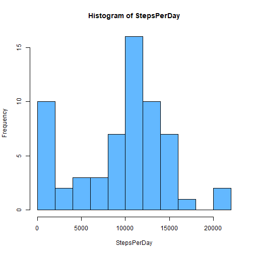
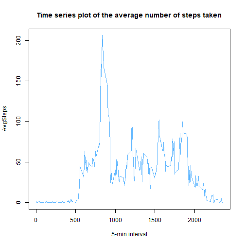
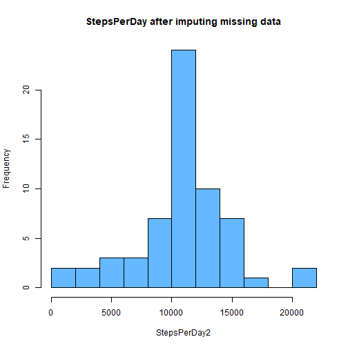
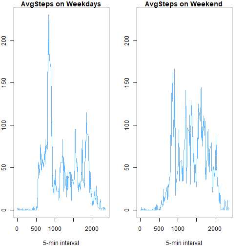

# Reproducible Research Course Project 

In this Project we'll be exploring the data from a personal activity monitoring device. This device collects data at 5 minute intervals through out the day. The data consists of two months of data from an anonymous individual collected during the months of October and November, 2012 and include the number of steps taken in 5 minute intervals each day. 

### Loading Library

Here we'll be importing all the libraries that we would use


```r
library(ggplot2)
```

```
## Learn more about the underlying theory at https://ggplot2-book.org/
```

```r
library(dplyr)
```

```
## 
## Attaching package: 'dplyr'
```

```
## The following objects are masked from 'package:stats':
## 
##     filter, lag
```

```
## The following objects are masked from 'package:base':
## 
##     intersect, setdiff, setequal, union
```

```r
#library(tidyr)
library(lubridate)
```

```
## Warning: package 'lubridate' was built under R version 4.0.2
```

```
## 
## Attaching package: 'lubridate'
```

```
## The following objects are masked from 'package:base':
## 
##     date, intersect, setdiff, union
```

### Downloading and Reading Data

In this section we will download and load the data


```r
desktop<- "C:/Users/Aditya Gupta/Desktop"
setwd(desktop)
fileUrl<- "https://d396qusza40orc.cloudfront.net/repdata%2Fdata%2Factivity.zip"

if(!file.exists("./CourseData")){
        dir.create("./CourseData")
        download.file(fileUrl,destfile="./CourseData/Dataset.zip")
        unzip("./CourseData/Dataset.zip",exdir="./CourseData")
  
}

Data<- read.csv("./CourseData/activity.csv")
head(Data)
```

```
##   steps       date interval
## 1    NA 2012-10-01        0
## 2    NA 2012-10-01        5
## 3    NA 2012-10-01       10
## 4    NA 2012-10-01       15
## 5    NA 2012-10-01       20
## 6    NA 2012-10-01       25
```

### Histogram of total number of steps per day

In this section we'll be taking a look at the histogram of the total number of steps taken each day


```r
StepsPerDay <- tapply(Data$steps,Data$date,sum,na.rm=TRUE)
#hist(StepsPerDay,col = "steelblue1",breaks = 15)
#hist(StepsPerDay,col = "steelblue1",breaks = 20)
hist(StepsPerDay,col = "steelblue1",breaks = 12)
```




The mean and median of StepsPerDay is not clear from the histogram, so let's calculate them separately


```r
MeanSteps <- mean(StepsPerDay)
MedianSteps <- median(StepsPerDay)
cbind(MeanSteps,MedianSteps)
```

```
##      MeanSteps MedianSteps
## [1,]   9354.23       10395
```

### Time Series Plot

Let's take a look at the Time series plot of the avg number steps taken 


```r
AvgSteps <- tapply(Data$steps,Data$interval,mean,na.rm=TRUE)
TimeInterval <- rownames(AvgSteps)
plot(y = AvgSteps, x= TimeInterval,type="l",xlab= "5-min interval",col="steelblue1")
title(main="Time series plot of the average number of steps taken")
```



We see that the max number of steps is some where around 900th 5-min interval, Let's find out exactly
which 5-min interval corresponds to the max number of steps


```r
AvgSteps[(which.max(AvgSteps))]
```

```
##      835 
## 206.1698
```

### Dealing with missing data

Let's check the data set for missing value


```r
sum(is.na(Data))
```

```
## [1] 2304
```

```r
mean(is.na(Data))
```

```
## [1] 0.04371585
```

We see that there are around 2300 missing values in our data, so we'll be imputing these with 
the mean for that 5-minute interval


```r
df = data.frame(Data)

for (i in 1:nrow(df)){
       
       if(is.na(df[i,"steps"])){
             
          df[i,"steps"] <- as.integer(AvgSteps[as.character(df[i,"interval"])]) 
       }
     
}
head(df)
```

```
##   steps       date interval
## 1     1 2012-10-01        0
## 2     0 2012-10-01        5
## 3     0 2012-10-01       10
## 4     0 2012-10-01       15
## 5     0 2012-10-01       20
## 6     2 2012-10-01       25
```

Now, let's take a look at the histogram for StepsPerDay again


```r
StepsPerDay2 <- tapply(df$steps,df$date,sum)
hist(StepsPerDay2,col = "steelblue1",breaks = 12,
     main="StepsPerDay after imputing missing data")
```



Again, let's see the mean and median for StepsPerDay 


```r
MeanSteps2 <- mean(StepsPerDay2)
MedianSteps2 <- median(StepsPerDay2)
cbind(MeanSteps2,MedianSteps2)
```

```
##      MeanSteps2 MedianSteps2
## [1,]   10749.77        10641
```

### Difference in activity patterns between weekdays and weekends

Let's see if there are any differences in activity patterns between weekdays and weekends


```r
df <- transform(df,date = ymd(date))
df["Day"] <- wday(df$date)
for (i in 1:nrow(df)){
  
  if((df[i,"Day"] == 1 | df[i,"Day"]==7)){
    
    df[i,"Day"] <- "weekend" 
  }
  else
    
    df[i,"Day"] <- "weekday"
  
}

AvgSteps2 <- with(df,tapply(steps,list(Day,interval),mean))
TimeInterval <- colnames(AvgSteps2)
par(mfrow=c(1,2),mar = c(4,2,1,2))
Upper <- max(AvgSteps2) 
plot(y = AvgSteps2["weekday",], x= TimeInterval,type="l",xlab= "5-min interval",
     ,main="AvgSteps on Weekdays",col="steelblue1")
plot(y = AvgSteps2["weekend",], x= TimeInterval,type="l",xlab= "5-min interval",
     ,main="AvgSteps on Weekend",col = "steelblue1",ylim=c(0,Upper))
```




